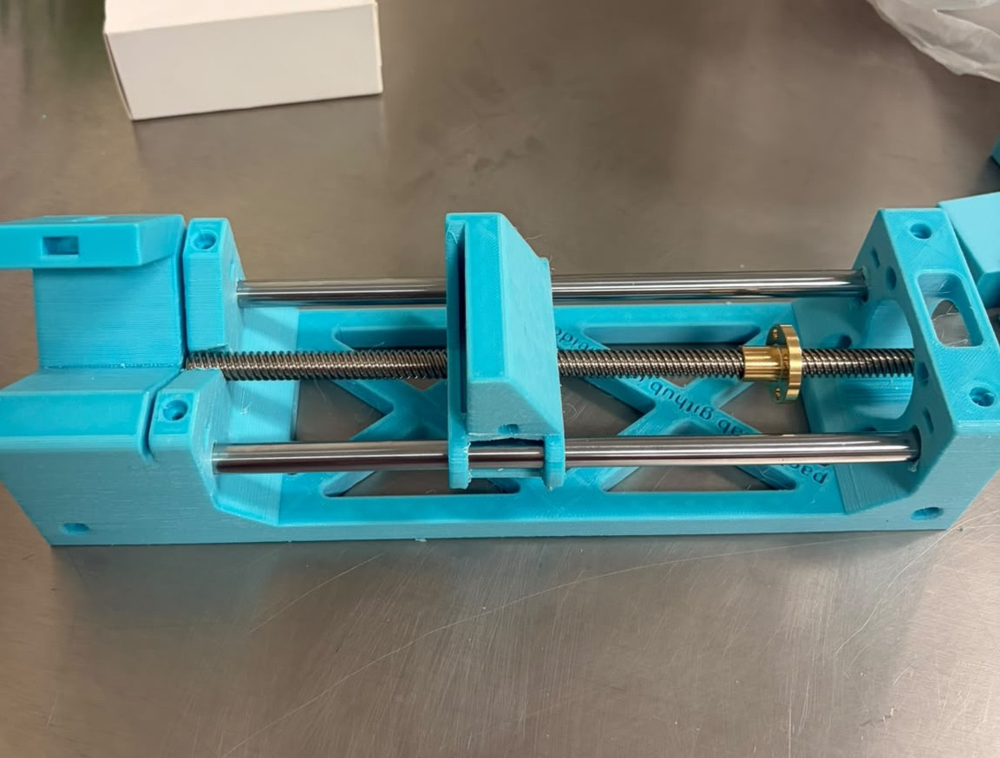
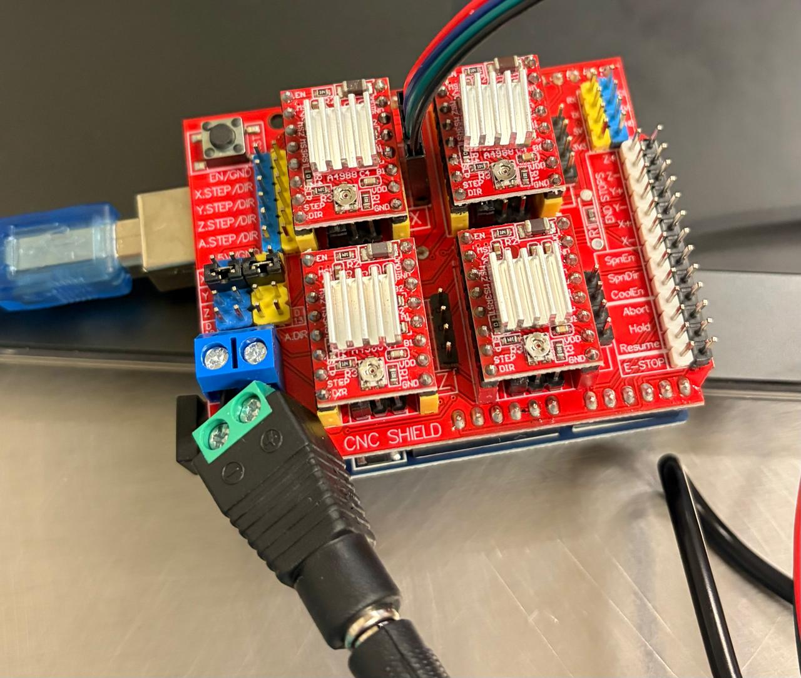

# Megaruptor

An open-source, low-cost DIY DNA shearing device built on the [Poseidon syringe pump](https://github.com/machineagency/poseidon) platform — designed as an accessible alternative to commercial mechanical shearing instruments (e.g., Diagenode Megaruptor 3) for genomic library preparation workflows, particularly long-read sequencing (Oxford Nanopore).

> **Status:** 🚧 In progress — components sourced, 3D printing and assembly underway.

---

## Overview

Mechanical DNA shearing instruments are a common bottleneck in labs working with long-read sequencing platforms, both in cost and accessibility. This project adapts the open-source Poseidon syringe pump design to build a functional, hackable shearing device using off-the-shelf electronics, 3D-printed parts, and standard insulin syringes as the shearing element.

The goal is a device that is:
- **Low-cost** — built from widely available components
- **Reproducible** — fully documented, open hardware
- **Hackable** — easy to modify shear force/speed parameters for different fragment size targets

---

## How It Works

DNA is sheared by repeatedly forcing a sample through a narrow-gauge needle at controlled speed, using a syringe pump mechanism driven by a stepper motor. Shear force and fragment size distribution are governed by needle gauge, plunger speed, and number of passes.

---

## Bill of Materials (Key Components)

| Component | Spec / Notes |
|---|---|
| Shearing element | BD Ultra-Fine 0.3 mL, 31G insulin syringes |
| Stepper motor | NEMA 17 |
| Motor driver | A4988 |
| Controller | CNC Shield V3 + Arduino Uno R3 |
| Safety | Mechanical limit switch (NC, fail-safe primary) + current sensing (secondary) |
| Frame/structural parts | 3D-printed (PLA), based on Poseidon design |

Full BOM with vendor links: [`docs/BOM.md`](docs/BOM.md) *(coming soon)*

---

## 3D Printed Parts

This build uses 4 standard components from the original Poseidon design, plus 2 custom parts designed for this build:

| Part | Type | Notes |
|---|---|---|
| Poseidon base/frame components (×4) | Standard | From original Poseidon design |
| Sleeve adapter | Custom | OD 8 mm, ID 6.1 mm, 30 mm length |
| Eppendorf bracket | Custom | 45° angle mount |

All STL files are available in [`/STL`](./STL). Source CAD files (where available) are in [`/CAD`](./CAD).

---

## Repository Structure

```
megaruptor/
├── README.md
├── STL/                  # Printable 3D files
├── CAD/                  # Source CAD files (Fusion 360 / FreeCAD)
├── firmware/             # Arduino control code
├── docs/
│   ├── BOM.md            # Full bill of materials with vendors/costs
│   ├── DECISIONS.md      # Design decisions & rationale
│   ├── ASSEMBLY.md       # Build/assembly instructions
│   └── images/           # Build photos
```

---

## Design Decisions

Key engineering choices and their rationale are documented in [`docs/DECISIONS.md`](docs/DECISIONS.md), including:
- Hybrid safety design (mechanical limit switch + current sensing) over software-only stall detection
- Choice of insulin syringe gauge for shearing element
- Custom part tolerances (e.g., sleeve adapter fit)

---

## Build Progress

- [x] Source components (NEMA 17, A4988, Arduino Uno R3, syringes)
- [x] Design custom parts (sleeve adapter, Eppendorf bracket)
- [x] 3D print all components
- [x] Full mechanical assembly
- [ ] Firmware integration and motor control testing
- [ ] Validation with real DNA samples (fragment size distribution vs. commercial shearing)

---

## Progress Log

### July 21 2026
Mechanical assembly in progress. Key steps completed this round:

- Drilled out the rod holes on the 3D-printed PLA parts to fit the guide rods — the as-printed tolerances were too tight, so holes were carefully widened with a drill bit until the rods slid through smoothly.
- Installed screws on all designated screw holes across the printed parts to secure the frame.
- Threaded the brass (gold) lead screw nut onto the central leadscrew and secured it inside the carriage's nut trap with M3 screws, so it stays anti-rotated — this is what converts the leadscrew's rotation into linear motion, pulling the carriage along the two guide rods instead of just spinning freely with the screw.
- Mounted the carriage onto the guide rods and confirmed it slides smoothly along the full travel range by turning the leadscrew by hand.



📹 [Watch the assembly video](docs/images/progreso_julio2026/video1.mp4)

### July 27, 2026

**A4988 Driver Calibration — Complete**

Key steps completed this round:

- Installed jumper headers at each motor position on the CNC shield to configure 1/2-step mode.
- Seated all four A4988 drivers into their respective positions on the CNC shield (X, Y, Z, and A axes).
- Mounted the CNC shield onto the Arduino UNO.
- Calibrated each A4988 driver to a reference voltage of 0.96V using a digital multimeter, with the negative probe on the CNC shield's GND pin and the positive probe used to measure the potentiometer during adjustment. This value was derived from: Vref = Imax × (8 × Rsense) = 1.2A × (8 × 0.1Ω) = 0.96V.
- Voltage adjustments were made by turning each driver's onboard potentiometer with a small screwdriver while simultaneously monitoring voltage with the multimeter's positive probe.
- Once all four drivers were calibrated to 0.96V, proceeded to connect the NEMA 17 stepper motor.
- **Note:** Many NEMA 17 motors ship with connectors where the wire color order differs between the motor and driver ends. This was the case here — the pin order did not match. To correct it, I released the terminals from the connector housing using a small screwdriver and reseated them in the correct sequence.
- Connected the NEMA 17 motor to the CNC shield via the X-axis A4988 driver.



---

## Acknowledgments

This project builds on the open-source [Poseidon](https://github.com/machineagency/poseidon) syringe pump platform. Full credit to the original design team for the foundational mechanical design this project adapts.

---

## License

*(To be determined — consider MIT for firmware/code and CC-BY or CC-BY-SA for hardware designs)*

---

## Author

**Regina Ruiz** — Bioinformatics / Lab Sciences, Granatum Bioworks
[GitHub](https://github.com/reginaruizb) · *(add site/LinkedIn link here)*