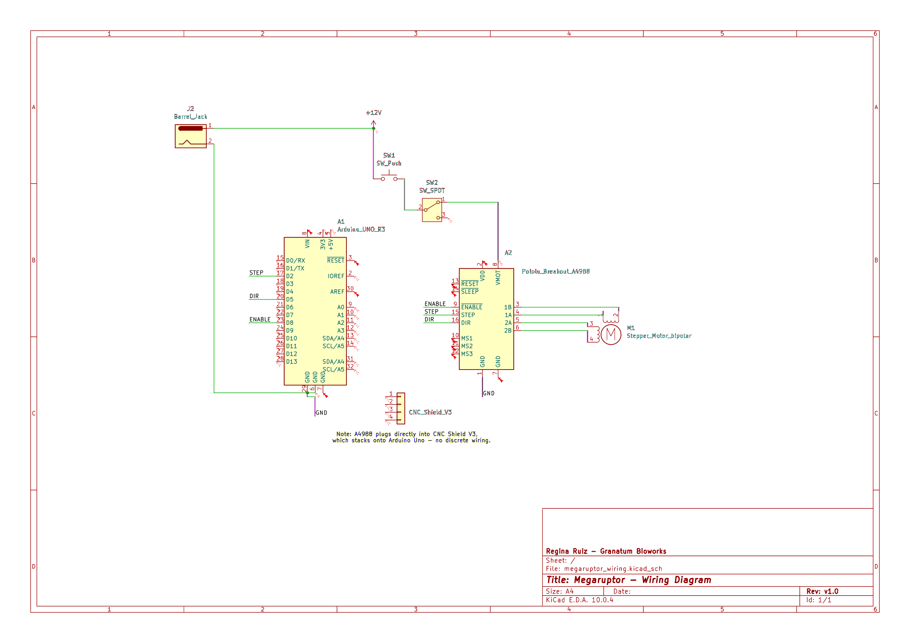
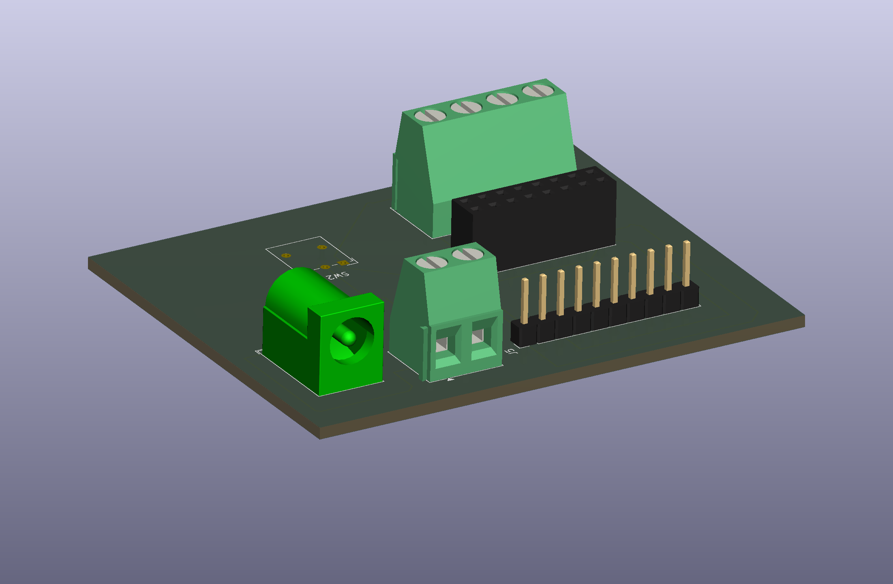

# Electronics Documentation

This section documents the electronics design for the Megaruptor, developed in KiCad. Two designs are included: a wiring diagram of the control electronics as currently assembled, and a proposed custom PCB shield that could replace the generic CNC Shield V3.

---

## 1. Wiring Diagram

A schematic capturing the full control circuit: Arduino Uno R3, A4988 stepper driver, NEMA 17 motor, power switch, limit switch (fail-safe), and 12V barrel jack input.

### Key design points
- **Fail-safe power path:** +12V flows through the general power switch (SW1) and then through the limit switch (SW2, wired NC) before reaching the driver's VMOT pin. If the limit switch is triggered, motor power is cut directly — no firmware dependency. See [DECISIONS.md](DECISIONS.md#safety-system-hybrid-mechanical-limit-switch--current-sensing) for the rationale.
- **Control signals:** STEP (D2), DIR (D5), and ENABLE (D8) connect directly from the Arduino to the A4988. Physically, these pass through the CNC Shield V3 (noted on the diagram), which stacks onto the Arduino — no discrete wiring exists for this path.

KiCad project: [`electronics/megaruptor_wiring/`](../electronics/megaruptor_wiring/)

---

## 2. Custom Shield PCB (Proposed Design)

A proposed custom PCB shield that would replace the generic CNC Shield V3 — sized to the Arduino Uno standard shield footprint (53.4mm x 68.6mm), carrying only the signals actually used by this build (STEP, DIR, ENABLE, GND, +12V power path, and motor terminal).

📄 [Download full PCB plot (PDF)](megaruptor_shield.pdf)

### Why a custom shield
The CNC Shield V3 is designed for 3-axis CNC control (X/Y/Z), but this build only drives a single stepper motor. A custom shield:
- Removes unused headers/drivers for the other two axes
- Integrates the fail-safe switch wiring directly onto the board instead of external jumper wires
- Is a natural next step if this design moves toward small-batch fabrication

### Component footprints used
| Component | Footprint |
|---|---|
| J2 (Barrel Jack) | `BarrelJack_Horizontal` (5.5mm x 2.1mm) |
| J5 (Arduino connection) | `PinHeader_1x10_P2.54mm_Vertical` |
| A2 (A4988 driver) | `PinSocket_2x08_P2.54mm_Vertical` (socketed, not soldered direct) |
| SW1 (power switch) | `TerminalBlock` 1x02 (external rocker switch, wired by cable) |
| SW2 (limit switch) | `SW_Lever_1P2T_NKK_GW12LxH` |
| M1 (motor) | `TerminalBlock` 1x04 |

**Status:** Schematic and PCB layout complete, 0 DRC errors. Not yet fabricated.

KiCad project: [`electronics/megaruptor_shield/`](../electronics/megaruptor_shield/)
